# Beginners Oracle JET HOL 2017

### Prerequisites
* node 4+ (preferably the LTS)
* follow the steps at the root of this project to install command line tools

>If you are running this HOL from behind a firewall, please make sure you have the npm proxy configurations setup properly before running any of the below steps

### Seeing the final project first
If you would like to see what your final project will look like when you are finished, you can follow these steps.  
From the root of the [**beginners-finished**](./beginners-finished) directory, run the following commands: 
```
npm install  
ojet serve
```
The project will install all of the required files and then build and serve the application in your default browser. You can use the code from this project to compare with your own code that you will be writing under the **/beginners-start** directory 

***
### Getting Started

To get the initial project setup for your Hands-On-Lab, run the following command from the command line at the root of the **/beginners-start** directory:  

```
ojet create myHOL2017 --template=navdrawer
```

Once the above command completes, you should have a directory structure that looks similar to Image 1 below.  

  
**IMAGE 1**  

To build the default project, run:  
```
ojet build
```

>By default this will build a web application for you and add a /web folder to your project root.  This is what you will be working with >for this HOL, however, if you had Cordova and the appropriate SDK installed for Android, iOS, or Windows, you could build a JET hybrid >application by running the same command as above, with these additional options: 
> 
> `--hybrid --platform=android | ios | windows`  


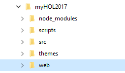  
**IMAGE 2**  


***
### Editing the project
Make all code edits in the **/src folder**.  
If you make edits to any HTML, CSS, or JavaScript files while the `ojet serve` command is running, 
the changes will automatically be pushed to the /web folder and the browser will refresh.

Adding or removing libraries from the project will require a rebuild.

### Creating a Composite Component
In JET, there is a concept of a reusable component called a composite component. You will often see this referred to as a CCA component as well.  CCA stands for Composite Component Architecture.  These special kinds of components are built according to the HTML5 Web Component specification and can be re-used across multiple Oracle development frameworks and tools, such as the Visual Builder Cloud Service and Sites Cloud Service.

To create your new component run the following command from the root of the project that you just created.  
```
ojet create component my-chart
```

>The name of your component can be different, but it must be all lowercase and have at least one hyphen in the name.  This naming convention is part of the HTML5 web component specification.

Once you have created your component, you will see that it has been added to a directory called **jet-composites** using the name that you gave your component.  This new component directory contains the default template. The directory structure of your project should now look like image 3 below

  
**IMAGE 3**

***
### Using an editor or IDE of your choice
So far, you have used the command line for quickly setting up the structure of your application.  From this point on, you are going to be editing code, as well as copying and pasting code from the Oracle JET Cookbook website.  JET is written in regular JavaScript, HTML, and CSS.  Because of this, you can use just about any editor that provides support for these technologies.  

The screenshots showing code and application structure in this HOL, will be from NetBeans IDE.  NetBeans can open an existing JET application without any configuration or special setup.  Just choose "open project" from the NetBeans menu toolbar or menu and navigate to the root of your application.

### Adding the default component to your application page
Now that you have a new composite component, let's add it to the Dashboard page of your application.
JET starter templates use a feature of JET called ojModule.  This is the ability to define a view (HTML) and a viewModel(JS) and combine them to deliver a specific section of the page as a simple module.  These view and viewModel files are found in the /js directory under directories of the same name.

Open the dashboard.html file from the **/js/views** directory and add the following HTML code just under the `<H1>` element. 

```xml
<mychart id="chart1"></my-chart>
```

The resulting code will look like image 4 below.

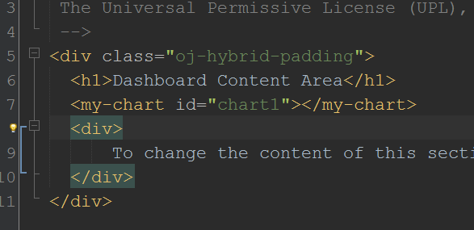  
**IMAGE 4**


Now open the dashboard.js file located in the **/js/viewModels** directory and add a reference to your new my-chart component in the **define** block at the top of the file.

The code you are going to add is a path to the **loader.js** file of your component.

`jet-composites/my-chart/loader`
 
 and the final code will look like image 5 below.
 
   
**IMAGE 5**
 
Save both files and run your application again by typing:

```
ojet serve
```

You should see the application loaded in your default browser, and the Dashboard page will look like image 6 below. Notice the **Hello from Example Component** message.

   
**IMAGE 6**

 
 ***
 
 ### Making things more interactive
 By default, your new component only displays new content into your page. However you can define HTML5 attributes for your component that will allow the developer to pass in values to your component at runtime.  Your component can then process those values and use  them to manipulate the content that you want to display.


####  Adding an attribute in HTML
To make things simple, let's let the developer pass in the message that we display when the component is rendered. Re-open the dashboard.html file and add an attribute to the `<my-chart>` element.  Name this attribute **my-message** and set the value to anything you like.

```xml
<my-chart id="chart1" my-message="My new message from runtime"></my-chart>
```

>Notice that the custom attribute starts with a prefix of **my-**. It's a good idea to add some kind of prefix to your attributes to help avoid the chance of naming an attribute after some existing attribute that you were not aware of.  Like a reserved word for the base HTML element that your composite component could be based on.

#### Defining the attribute in your component
You now have the HTML code ready to send a new message to your component. But you need to tell your component to look for that attribute first, and then decide what you are going to do with that information once you find it.

Go to the **/js/jet-composites/my-chart/** directory and open the **component.json** file. This is the main definition file for your components metadata.  You can set the _name_, _description_, _version_, and many other propertiess in this file. One important property  to set is the _jetVersion_ property. This tells a developer what version of JET your component is written (and hopefully tested) to work with.  Most of these properties will be used when you publish your component to a future component catalog.

For this Hands-on-Lab, you are going to add the definition of your attribute to the _properties_ object. You will provide the name, and the type of data that is going to be passed by the attribute. The code that you are going to add will be:

```javascript
  "properties": {
    "myMessage": {
      "type": "string"
    }
  },
```
There are a couple of key points to notice in the above code.  When you defined the attribute in your HTML code, you used a hyphen (-) to separate your prefix from your attribute name.  Notice in the JSON definition, you remove that hyphen and make the first letter that followed it, an upper case letter. The basic rule is that camel-case property names are converted into case-insensitive HTML element attributes with hyphens at the camel-case break point of the original name. So _myMessage_ has become _my-message_.

You have also defined the _type_ that this attribute will pass, to be a string. The final components.json file will look like image 7 below.

 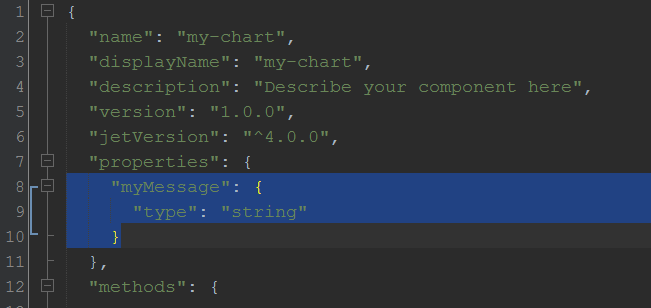  
**IMAGE 7**

#### Telling the component what to do with the value
The component now knows to look for the _my-message_ attribute.  Let's now connect the business logic in the viewModel of your component to use that attributes value to display the message where we want it.

Open the _viewModel.js_ file from your **/js/jet-composites/my-chart** directory.  In the default template, the value for the _self.messageText_ observable is hardcoded to a set value.  You are going to add a line in the _context.props_ Promise callback function to set the observable value to the string that is passed in by the DOM elements _my-message_ attribute.

>Knockout.js observables  
An "observable" or "observableArray" is a special type of two-way binding variable used by Knockout.js. When the value is changed by either the UI, or the JavaScript ViewModel, the other references to the observable are automatically updated as well.


Looking at image 8 below, there are a few things to pay attention to:  
* The original definition of the self.messageText knockout observable variable
* The _context.props.then()_ method holds the callback function that returns a list of all the properties that your component has defined. Notice how the _context.props_ method returns a Promise which allows our callback function to only be called after the properties are available.
* Using the self.properties object, we can get the value of the _myMessage_ property and set the value of _self.messageText_ to that value.  Notice how a Knockout observable value is set by passing in the value as an argument to a method, and not by using the **=** assignment operator. 


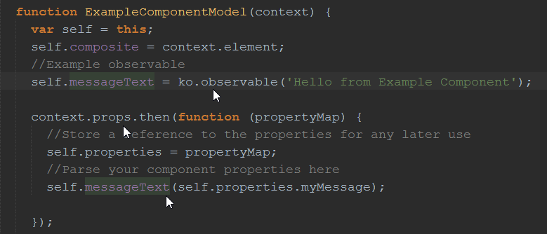  
**IMAGE 8**

Save your changes and you should see your new message being displayed instead of the default one.
>If you still have the `ojet serve` command running, all of these changes will have been saved, compiled and the brower refreshed for you automatically. If you stopped the serve command earlier, re-run `ojet serve` to see the updates.

***
### Working with prettier things
You have now finished your first composite component and you could make multiple instances of the element in the _dashboard.html_ file with different messages if you liked.  That is pretty boring though, so let's add something a little more complex and make multiple instance of that.

Open the _view.html_ from your composites directory.  You will see the existing `<span>` element that is rendering your runtime message right now.  You are going to add a Chart component from the JET Data Visualization collection and bind the type of chart to an attribute that can be defined in the HTML DOM.

To add the chart component to your components view, you are going to copy and paste some HTML from the JET Cookbook page. Open the [Bar Chart Cookbook page](http://www.oracle.com/webfolder/technetwork/jet/jetCookbook.html?component=barChart&demo=default) in a new browser window so you can easily copy and paste between two windows.

Looking at the Cookbook demo page, look for the tabs that allow you to see, _demo.html_, _demo.js_ or _all_, and click on the All tab.  It will look like image 9 below.

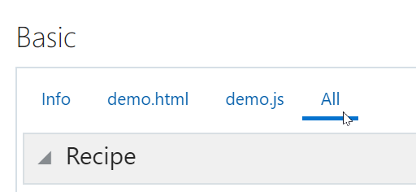  
**IMAGE 9**


Selecting _All_ will allow you to see both the HTML and the JavaScript at the same time and will be easier for doing copy and paste.
Look at the HTML Editor section and copy the code that you see in image 10 below. You do not need any other HTML code from this section.

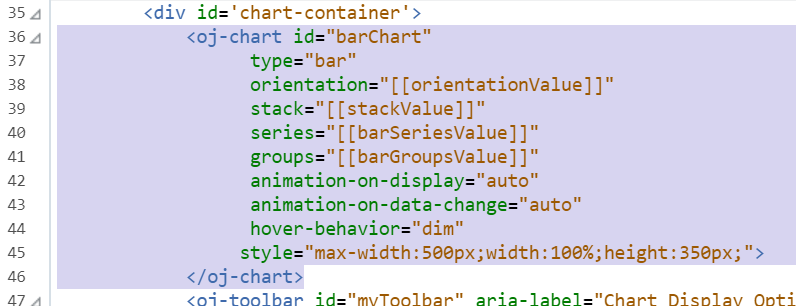  
**IMAGE 10**


Place the HTML code into the _view.html_ file just below the existing `<span>` element.
Remove the attributes for _orientation_ and _stack_ from the code that you copied over.
You code will look like image 11 below when completed.

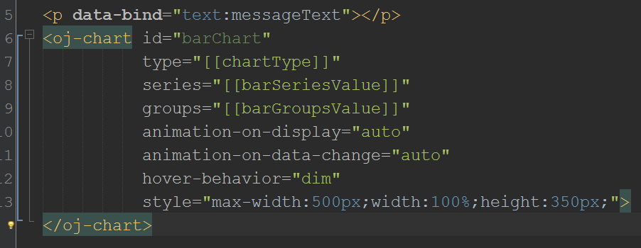  
**IMAGE 11**


Now that you have your HTML for the chart, open the _viewModel.js_ file and go back to the Cookbook page so you can copy the JavaScript code related to your chart. Image 12 below shows what you are going to copy from the JavaScript Editor section of the Cookbook page.

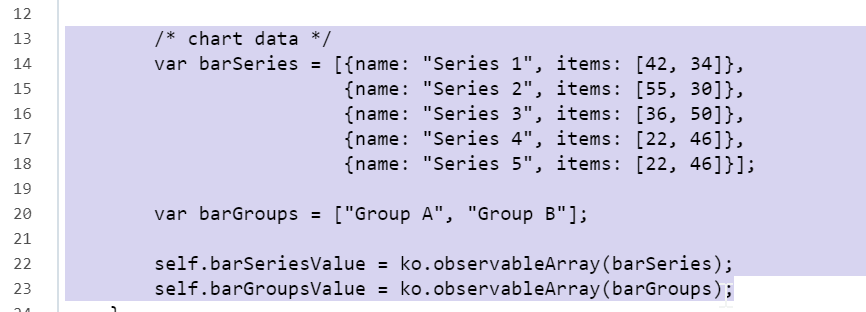  
**IMAGE 12**


Paste the code into the _viewModel.js_ file just after the `context.props` function.  Make sure it's still inside of the _ExampleComponentModel_ function though.  Image 13 will show the proper location.

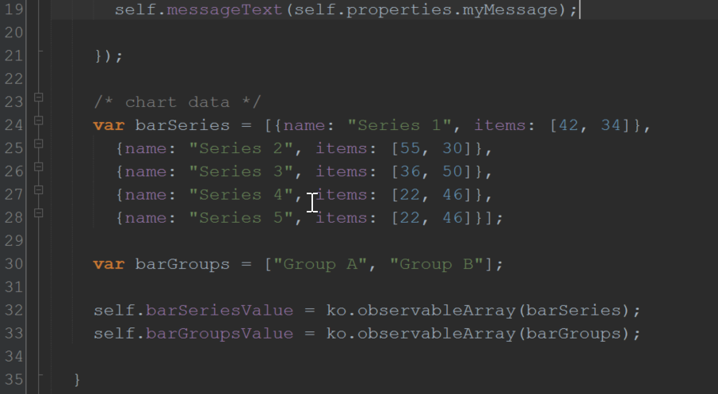  
**IMAGE 13**

You now have the values for the data that will populate your chart, but you need to add a reference to the attribute that will be passed into your component from the custom element.  At the top of the _viewModel.js_ file, just under the `self.messageText` variable, add a new variable called `chartType` and give it a default value of **bar**

```javascript
self.chartType = "bar";
```

Now go down to the `.then()` Promise callback function where you setup the _myMessage_ assignment and add another assignment for this attribute _chartType_.  Image 14 below will show the final setup in the _viewModel.js_ file.

```javascript
self.chartType = self.properties.chartType;
```

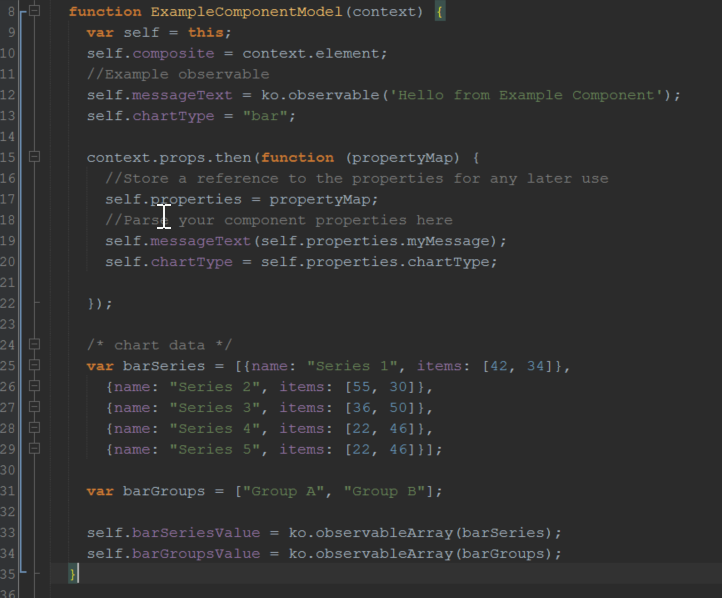  
**IMAGE 14**


If you haven't noticed, you are working backwards from what you did when you setup the _myMessage_ attribute code.  You now have the view and viewModel for your composite component done. Next you need to add this _chartType_ property to the _component.json_ file so that the component knows to listen for it from the DOM and pass it to your component logic.

Open the _component.json_ file.

In the properties object, just below where you added your `myMessage` definition, add a new one for `chartType`. Set the value type to string again.

```javascript
"properties": {
  "myMessage": {
    "type": "string"
  },
  "chartType": {
    "type": "string"
  }
}
```  

Save your files and reload the app in the browser. Again, if you haven't stopped the `ojet serve` command from earlier, all of these changes should be automatically taken care of in your product and the browser will refersh for you.  You should see a chart in your Dashboard page with the default _chartType_ of _bar_ being used.  It should look like image 15 below

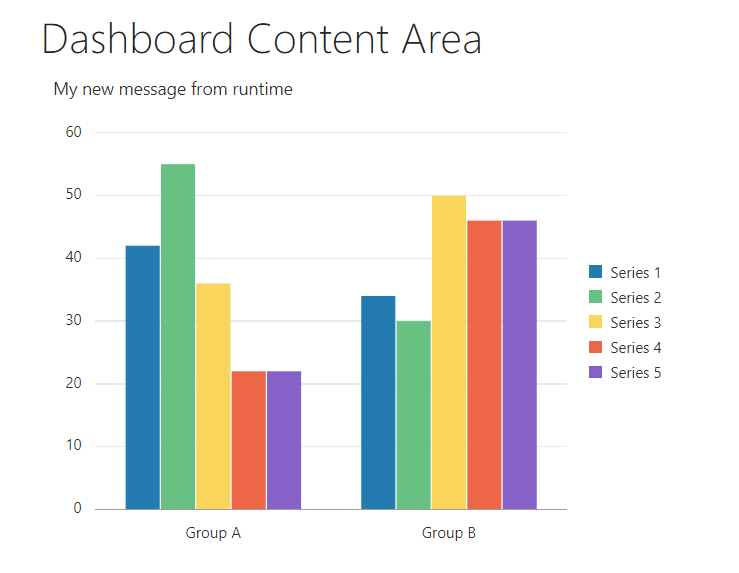  
**IMAGE 15**


Your final step is to update the attributes in your `<my-chart>` custom element in the dashboard.html file, by adding the `chart-type` attribute. Use _line_ as the new value.

```xml
<my-chart id="chart1" chart-type="line" my-message="My new message from runtime"></my-chart>
```


