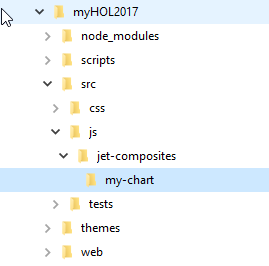

# Beginners Oracle JET HOL 2017

### Prerequisites
* node 4+ (preferably the LTS)
* follow the steps at the root of this project to install command line tools

>If you are running this HOL from behind a firewall, please make sure you have the npm proxy configurations setup properly before running any of the below steps

### Seeing the final project first
If you would like to see what your final project will look like when you are finished, you can follow these steps.  
From the root of the [**beginners-finished**](./beginners-finished) directory, run the following commands:  
`npm install`  
`ojet serve`

The project will install all of the required files and then build and serve the application in your default browser. You can use the code from this project to compare with your own code that you will be writing under the **/beginners-start** directory 

***
### Getting Started

To get the initial project setup for your Hands-On-Lab, run the following command from the command line at the root of the /beginners-start directory:  

`ojet create myHOL2017 --template=navdrawer`

Once the above command completes, you should have a directory structure that looks similar to Image 1 below.  

  
**IMAGE 1**

To build the default project, run:  

`ojet build`

>By default this will build a web application for you and add a /web folder to your project root.  This is what you will be working with for this HOL, however, if you had Cordova and the appropriate SDK installed for Android, iOS, or Windows, you could build a JET hybrid application by running the same command as above, with these additional options:  
> `--hybrid --platform=android | ios | windows`  

  
**IMAGE 2**

***
### Editing the project
Make all code edits in the **/src folder**.  
If you make edits to any HTML, CSS, or JavaScript files while the `ojet serve` command is running, 
the changes will automatically be pushed to the /web folder and the browser will refresh.

Adding or removing libraries from the project will require a rebuild.

### Creating a Composite Component
In JET, there is a concept of a reusable component called a composite component. You will often see this referred to as a CCA component as well.  CCA stands for Composite Component Architecture.  The special kinds of components are built according to the HTML5 Web Component specification and can be re-used across multiple Oracle development frameworks and tools, such as the Visual Builder Cloud Service and Sites Cloud Service.

To create your new component run the following command from the root of the project that you just created.  
`ojet create component my-chart`

>The name of your component can be different, but it must be all lowercase and have at least one hyphen in the name.  This naming convention is part of the HTML5 web component specification.

Once you have created your component, you can see the default template that has been created for you in the  
**/src/js/jet-composites/my-chart**. The directory structure of your project should now look like image 3 below

  
**IMAGE 3**

